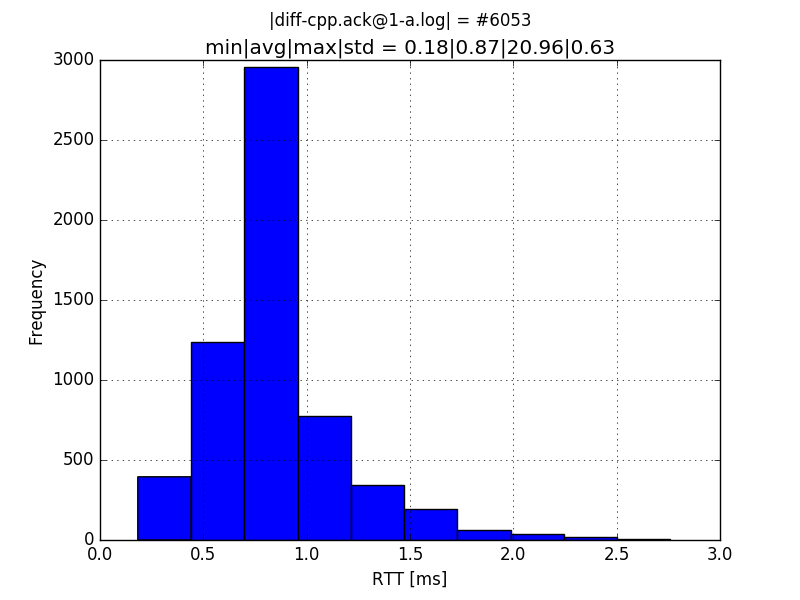
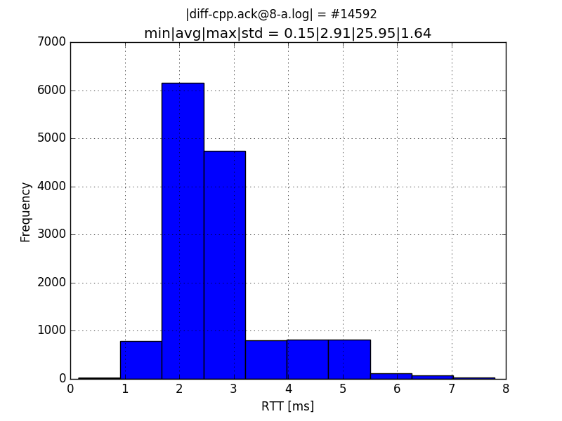

# ProtoBuf.Rpc.js: RTT measurements

[matplotlib]: http://matplotlib.org
[NodeJS]: https://nodejs.org/api
[NPM]: https://www.npmjs.com
[ProtoBuf.js]: https://github.com/dcodeIO/protobuf.js
[ProtoBuf.Rpc.js]: https://github.com/hsk81/protobuf-rpc-js
[Protocol Buffers]: https://developers.google.com/protocol-buffers/docs/proto3
[Python]: https://www.python.org
[QT/C++]: https://www.qt.io
[Tornado]: http://www.tornadoweb.org/en/stable

## Overview

The QT/C++ server in combination with NodeJS client provides the result with an average latency of `870` micro-seconds and `605.3` messages per seconds:



Also the same combination provide the result with an average latency of `2.91` mill-seconds and `1459.2` messages per seconds:



The corresponding client NodeJS commands to capture the data for the first image, where the QT/C++ Server was running:

```bash
cd pb-rpc.git && ./example/client/js/rpc-client.js -a0 -s0 -m0 -d0 --n-ack=1 > log/diff-cpp.ack@1-a.log ;
```

And for the second image:

```bash
cd pb-rpc.git && ./example/client/js/rpc-client.js -a0 -s0 -m0 -d0 --n-ack=8 > log/diff-cpp.ack@8-a.log ;
```

Increasing the `n-ack` parameter has the effect that the client effective tries to produce more ACK message per unit of time, since it increases the number of intervals (via `setInterval`) which trigger a message:

```js
var n_ack = args.n_ack, iid_ack = {};
for (var ack_i = 0; ack_i < n_ack; ack_i++) {
    iid_ack[ack_i] = setInterval((function (i, t) {
        var req = new Api.Reflector.AckRequest({
            timestamp: new Date().toISOString()
        });

        t[i] = process.hrtime();
        reflector_svc.ack(req, function (error, res) {
            if (error !== null) throw error;

            assert(res.timestamp);
            var dt = process.hrtime(t[i]); t[i] = process.hrtime();
            console.log('dT[ack]@%d:', i, dt[0] * 1E3 + dt[1] / 1E6);
        });
    }).with(ack_i, {}), 0);
}

setTimeout(function () {
    for (var key_ack in iid_ack)
        if (iid_ack.hasOwnProperty(key_ack))
            clearInterval(iid_ack[key_ack]);
}, 10000);
setTimeout(function () {
    process.exit();
}, 10000);
```

The latter `process.exit` after `10` seconds is required, since `clearInterval` does not immediately stop the execution after the set duration. The `process.hrtime` function is a high resolution timer with the capability to measure sub-milli-seconds differences.

## Data reproduction

Specifications: Lenovo X230, Intel CORE I5, GNU/Linux 4.2.5-1-ARCH #1 SMP, where the network adapter has been switched off via hard- and software.

### Client NodeJS

Requires [NodeJS] and [NPM]:

    nodejs 5.0.0-2
    npm 3.4.0-1
    
Then install NPM dependencies:

```bash
cd pb-rpc.git && npm install
```

Ensure a running server (NodeJS, QT/C++ or Python) first; then `for i in 1 2 4 8` and `for j in a b` (and where `k one-in $(js, cpp, py)`):

```bash
cd pb-rpc.git && ./example/client/js/rpc-client.js -a0 -s0 -m0 -d0 --n-ack=$i > log/diff-$k.ack@$i-$j.log ;
```

### Server NodeJS

Requires [NodeJS] and [NPM]:

    nodejs 5.0.0-2
    npm 3.4.0-1
    
```bash
cd pb-rpc.git && make build-npm
cd pb-rpc.git && ./example/server/js/rpc-server.js
```

### Server QT/C++

Requires [Protocol Buffers]:

    protobuf3 3.0.0_beta_1-2

Requires QT5/C++:

    qt5-base 5.5.1-3  
    qt5-websockets 5.5.1-3  

```bash
cd pb-rpc.git && make build-server-cpp
cd pb-rpc.git && ./example/server/cpp/build/rpc-server
```

### Server Python

Requires [Python] 2:

    python2 2.7.10-2 
    python2-pip 7.1.2-2 
    python2-setuptools 1:18.5-1 
    python2-virtualenv 13.1.2-2 

Requires [Tornado]:

    python2-tornado 4.3.0-1
    
Requires [Protocol Buffers]:

    protobuf3 3.0.0_beta_1-2

Requires Python2 bindings for [Protocol Buffers]:

    python2-protobuf3 3.0.0_beta_1-2

```bash
cd pb-rpc.git && make build-npm
cd pb-rpc.git && ./example/server/js/rpc-server.js
```

### Plotting:

Requires [matplotlib]:

    python-matplotlib 1.5.0-1

Plot command to create histograms from the log files:

```bash
cat $LOG | cut -d' ' -f2 | ./plot.py --xlabel="RTT [ms]" --suptitle="|$LOG| = " -n 3.0 histogram ;
```
